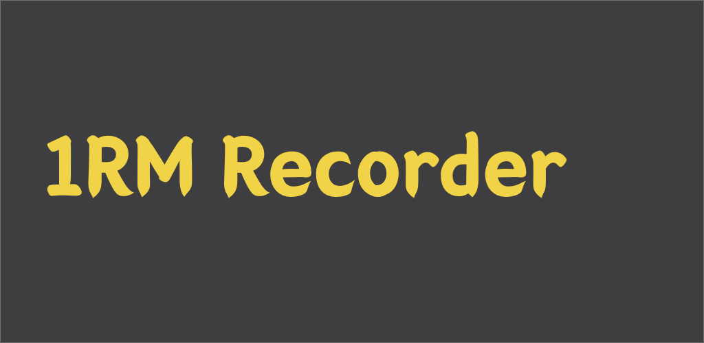
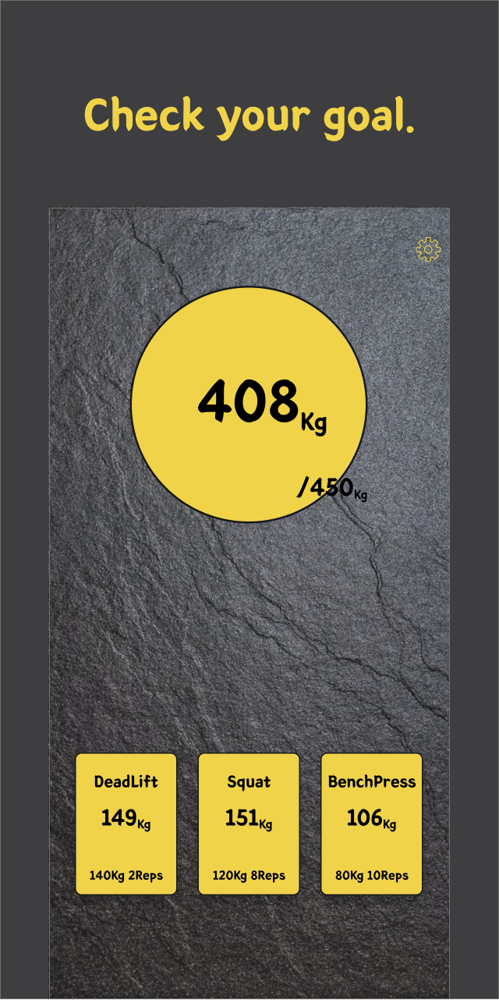
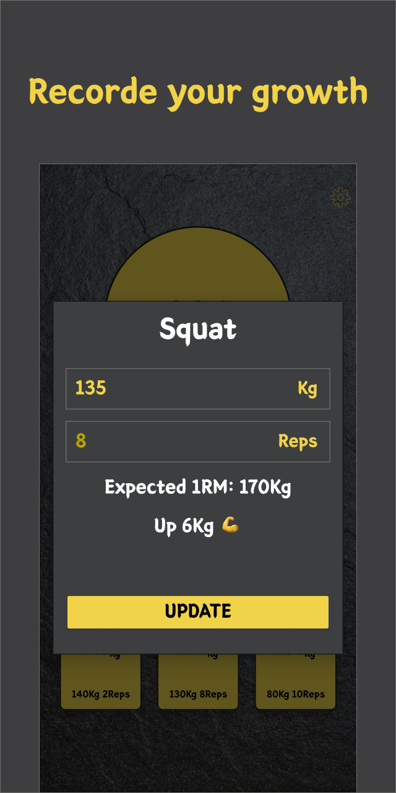
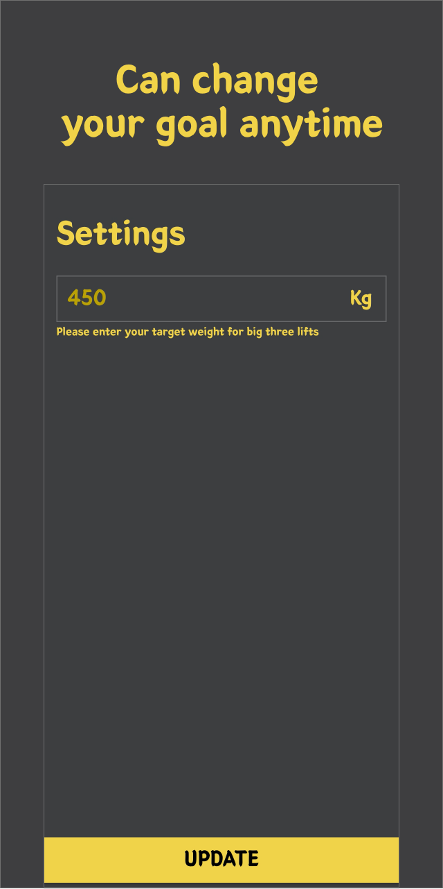

# 3대 측정기

## 플레이 스토어

안드로이드 앱 다운로드: https://play.google.com/store/apps/details?id=com.greedy0110.powerruler

## Goal

1RM 도전은 무섭고, 12회 반복, 5회 반복으로 3대 운동을 한 사람일 때,

자신의 1RM 3대가 몇일지 바로 알 수 있는 앱 (사실, 혼자 1RM 측정하기 무서워서 만든 앱)

## 주요 사용 기술

-   Hilt
-   DataBinding
-   LiveData
-   coroutine

## 아키텍쳐

-   MVVM 아키텍쳐 사용
    -   LiveData\<Signal\> 이용해 ViewModel - View간 통신

## 앱 이미지

